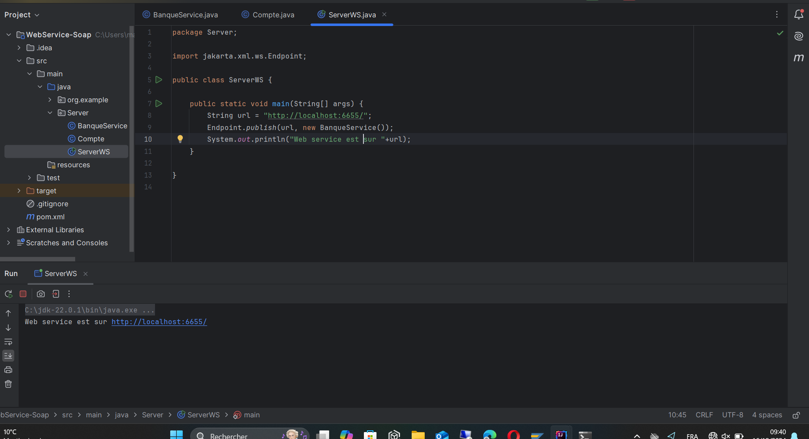
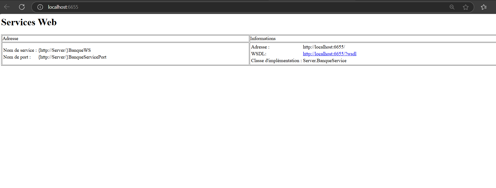
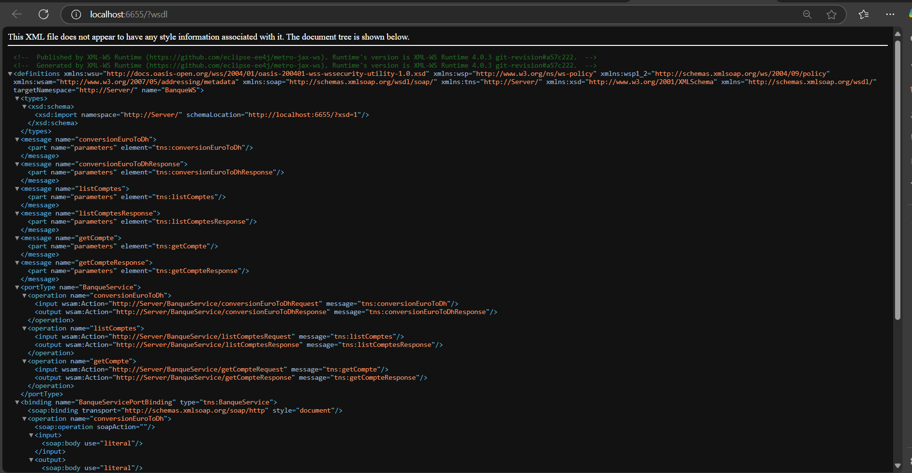
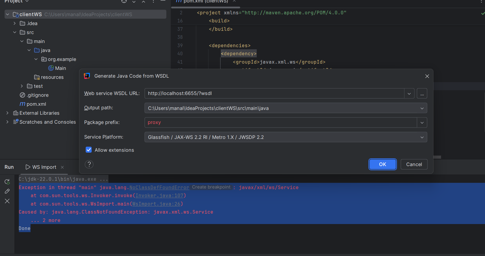
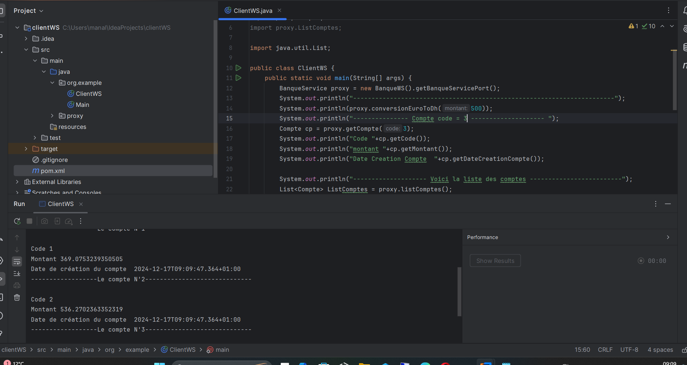
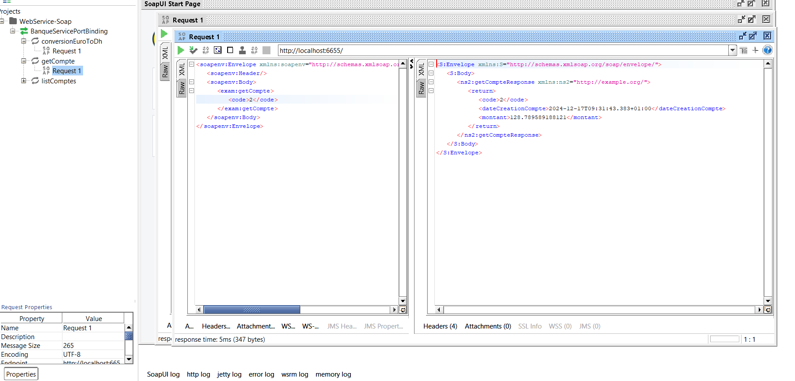
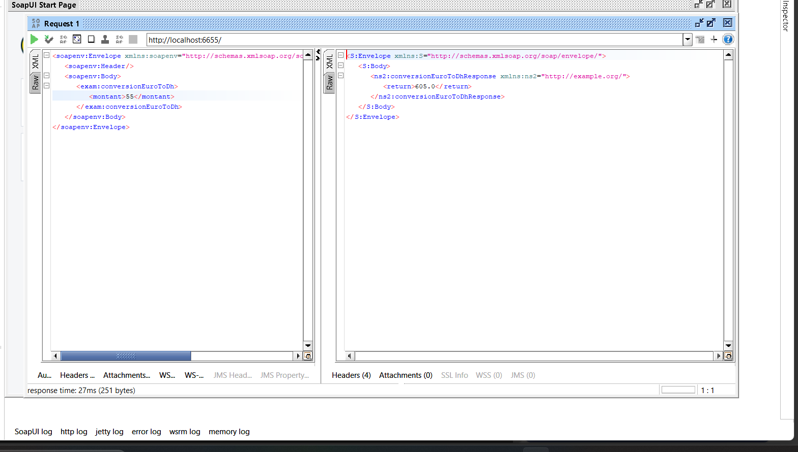
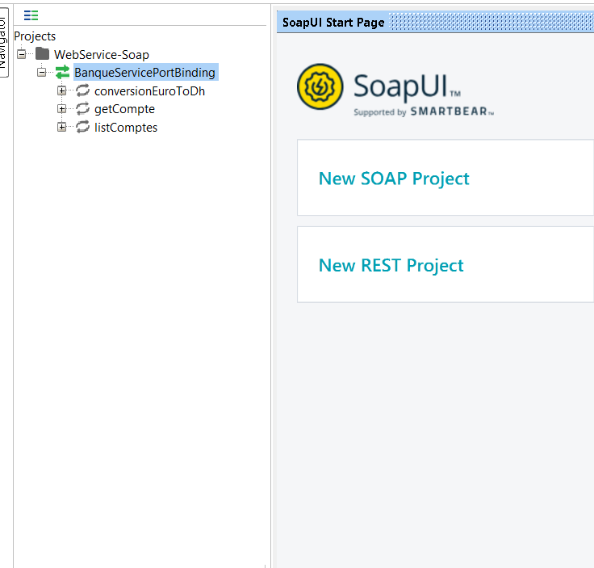

-----Projet de Web Service SOAP-----
----------Captures d’écran----------
#### Configuration du Serveur 

#### Fichier WSDL
 

#### Consommation de Web service   

#### Tester le Web Service sur SOAP UI

